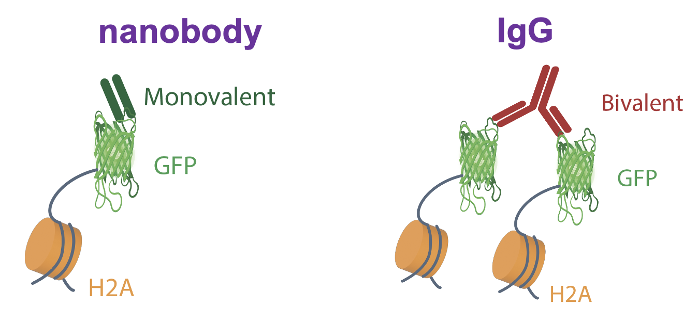

# Simulation Code for Draft Ab-trapping - a peripheral staining artifact in antibody-based microscopy and genomics


<div align="center">
  
  <p><em>Figure 1: Figure: Overview of the steps involved for antibody staining, including fixation, permeabilization, antibody binding, and fluorescence imaging. </em></p>
</div>

## 📁 Folder Contents  

- **`notebooks/antibody_simulation.jl`** – Main simulation script implementing the reaction-diffusion model.  
- **`notebooks/result_visualization.ipynb`** – Jupyter notebook for visualizing and analyzing simulation results. 
- **`notebooks/utils.jl`** - Utils functions for the simulation and visualization codes.
- **`data/parameters.json`**:  
  Contains the simulation parameters in JSON format.

## ⚙️ Installation & Dependencies  

Make sure you have [Julia](https://julialang.org/downloads/) installed on your system along with the required packages. You can install dependencies using:  

After installing Julia, you'll need to install the necessary dependencies for this project. You can do so by running the following commands in the Julia REPL:

1. Open Julia by typing `julia` in your terminal or using the Julia application.
2. Install the required packages by running:

```julia
using Pkg
Pkg.add(["MKL", "DifferentialEquations", "Symbolics", "Peaks", "CSV", "DataFrames", "JSON", "StatsBase", "Colors", "GLMakie", "Plots",  "Interpolations"])
```
We model Ab-trapping as reaction-diffusion systems (See Figure 2) which can be described by the following PDEs. 
## 
$$
\begin{aligned}
\frac{\partial c_A}{\partial t} &= D_A \nabla^2 c_A - k_{on} c_Ac_B + k_{off}c_{AB} \\
\frac{\partial c_B}{\partial t} &= D_B \nabla^2 c_B - k_{on} c_Ac_B + k_{off}c_{AB} \\ 
\frac{\partial c_{AB}}{\partial t} &= D_{AB} \nabla^2 c_{AB} + k_{on} c_Ac_B - k_{off}c_{AB} 
\end{aligned}
$$

The diffusion coefficient $D_B$ and $D_{AB}$ were set to be zero. For initial conditions, antigen was uniformly distributed in a sphere of radius $R_0=5 \mu m$ at concentration $c_B$; antibodies were distributed outside of this sphere in a concentric shell of $R_1=75 \mu m$  at concentration $c_A$. The intial concentration profiles were also smoothed. Details see Computational Methods of the draft. 

<div align="center">
  
  <p><em>Figure 2: A schematic of the reaction diffusion model of antibody staining. </em></p>
</div>

The solver used in this project is Rosa5P which is a fifth-order A-stable Rosenbrock method. For a comprehensive list of available solvers in Julia, please refer to the  [DiffEqDocs documentation](https://docs.sciml.ai/DiffEqDocs/stable/solvers/ode_solve/). To run the code for each figure, simply replace the figure name in Line 27 of **`antibody_simulation.jl`** with the desired figure name, such as Fig_2b1 (1, 2, 3 ,4 represents the first, second, third, fourth figure in the Figs. 2b-e).


### Parameters for Figs. 2b-e
| **Parameter**| **Value**| **Description**|
|----------------------|------------------------------------|------------------------------------------------------|
| **Association Rate**  | $k_{\text{on}} = 1.6 \times 10^9$ $M^{-1}s^{-1}$ | 1, 10, 50, 100 times, see Fig. 2b|
| **Dssociation Rate**   | $k_{\text{off}} = 24$ $s^{-1}$   | 1, 10, 50, 100 times, see Fig. 2c|
| **Epitope concentration**   | $c_{\text{b}} = 6.34 \times 10^{-5}$ $M$   | 1, 10, 50, 100 times, see Fig. 2d|
| **Diffusion Constant**   |  $D_{a} = 40$ $\mu m^2s^{-1}$  | 1, 10, 50, 100 times, see Fig. 2e|
| **Antibody concentration**   | $c_{\text{a}} = 1.328 \times 10^{-8}$ $M$   | |
| **Simulation Time** | 1800 $s$ | |


### Parameters for Fig. 2f
| **Parameter**| **Value**| **Description**|
|----------------------|------------------------------------|------------------------------------------------------|
| **Association Rate**  | $k_{\text{on}} = 1.6 \times 10^{10}$ $M^{-1}s^{-1}$ | Increase 10 times from baseline|
| **Dssociation Rate**   | $k_{\text{off}} = 2.4$ $s^{-1}$   | Decrease 10 times from baseline|
| **Epitope concentration**   | $c_{\text{b}} = 12.68 \times 10^{-5}$ $M$   | Increase 2 times from baseline|
| **Diffusion Constant**   |  $D_{a} = 40$ $\mu m^2s^{-1}$  | |
| **Antibody concentration**   | $c_{\text{a}} = 1.328 \times 10^{-8}$ $M$   | |
| **Simulation Time** | 1800 $s$ | |


### Parameters for Fig. 2g
| **Parameter**| **Value**| **Description**|
|----------------------|------------------------------------|------------------------------------------------------|
| **Association Rate**  | $k_{\text{on}} = 4.8 \times 10^9$ $M^{-1}s^{-1}$ | Increase 3 times from baseline|
| **Dssociation Rate**   | $k_{\text{off}} = 8$ $s^{-1}$   | Decrease 3 times from baseline|
| **Epitope concentration**   | $c_{\text{b}} = 6.34 \times 10^{-5}$ $M$   | |
| **Diffusion Constant**   |  $D_{a} = 3$ $\mu m^2s^{-1}$  | |
| **Antibody concentration**   | $c_{\text{a}} = 1.328 \times 10^{-8}$ $M$   | |
| **Simulation Time** | 1800 $s$ | |


### Parameters for Fig. 2h
| **Parameter**| **Value**| **Description**|
|----------------------|------------------------------------|------------------------------------------------------|
| **Association Rate**  | $k_{\text{on}} = 1.6 \times 10^{11}$ $M^{-1}s^{-1}$ |Increase 100 times from baseline|
| **Dssociation Rate**   | $k_{\text{off}} = 24$ $s^{-1}$   | |
| **Epitope concentration**   | $c_{\text{b}} = 6.34 \times 10^{-5}$ $M$   | |
| **Diffusion Constant**   |  $D_{a} = 40$ $\mu m^2s^{-1}$  | |
| **Antibody concentration**   | $c_{\text{a}} = 1.328 \times 10^{-8}$ $M$   | |
| **Simulation Time** | 72 $h$ | |


### Parameters for Fig. 2i 
| **Parameter**| **Value**| **Description**|
|----------------------|------------------------------------|------------------------------------------------------|
| **Association Rate**  | $k_{\text{on}} = 1.6 \times 10^9$ $M^{-1}s^{-1}$ | |
| **Dssociation Rate**   | $k_{\text{off}} = 24$ $s^{-1}$   | |
| **Epitope concentration**   | $c_{\text{b}} = 6.34 \times 10^{-5}$ $M$   | |
| **Diffusion Constant**   |  $D_{a} = 0.01$ $\mu m^2s^{-1}$  | Decrease 4000 times from baseline|
| **Antibody concentration**   | $c_{\text{a}} = 1.328 \times 10^{-8}$ $M$   | |
| **Simulation Time** | 72 $h$ | |


<div align="center">
  
  <p><em>Figure 3: Schematic representation of anti-GFP nanobody (monovalent) and anti-GFP IgG (bivalent).</em></p>
</div>


### Parameters for Extended Data Figure 8 c IgG 
| **Parameter**| **Value**| **Description**|
|----------------------|------------------------------------|------------------------------------------------------|
| **Association Rate**  | $k_{\text{on}} = 7.68 \times 10^6$ $M^{-1}s^{-1}$ | |
| **Dssociation Rate**   | $k_{\text{off}} = 1.74 \times 10^{-5}$ $s^{-1}$   | |
| **Epitope concentration**   | $c_{\text{b}} = 3.17 \times 10^{-6}$ $M$   | 1, 10 times |
| **Diffusion Constant**   |  $D_{a} = 40$ $\mu m^2s^{-1}$  | |
| **Antibody concentration**   | $c_{\text{a}} = 7.69 \times 10^{-10}$ $M$   | |
| **Simulation Time** | 1800 $s$ | |


### Parameters for Extended Data Figure 8 c Nanobody
| **Parameter**| **Value**| **Description**|
|----------------------|------------------------------------|------------------------------------------------------|
| **Association Rate**  | $k_{\text{on}} = 7.68 \times 10^5$ $M^{-1}s^{-1}$ | |
| **Dssociation Rate**   | $k_{\text{off}} = 1.74 \times 10^{-4}$ $s^{-1}$   | |
| **Epitope concentration**   | $c_{\text{b}} = 3.17 \times 10^{-5}$ $M$   | 1, 10 times |
| **Diffusion Constant**   |  $D_{a} = 200$ $\mu m^2s^{-1}$  | |
| **Antibody concentration**   | $c_{\text{a}} = 7.69 \times 10^{-10}$ $M$   | |
| **Simulation Time** | 1800 $s$ | |


